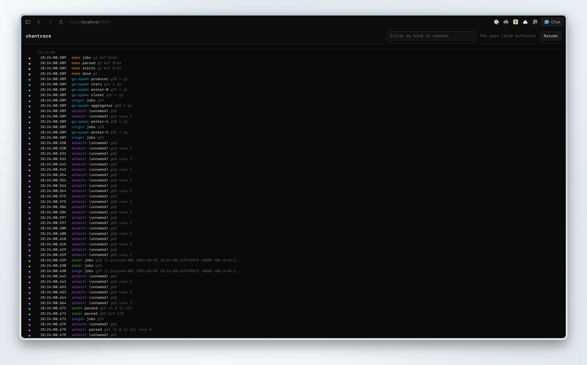
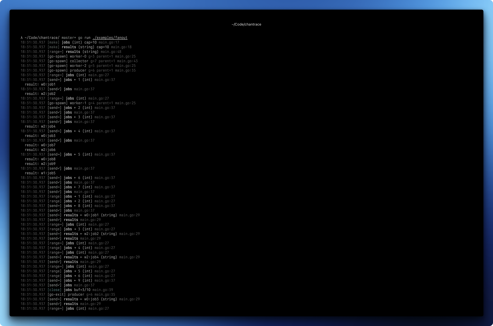

# chantrace

On-demand concurrency diagnostics for Go: tracing, analysis, and tooling.

chantrace is built for focused debugging and observability sessions when you need visibility into channel operations and goroutine lifecycles. It helps you move from raw events to actionable diagnostics such as blocked operations, leaked goroutines, and trace-loss signals.

Channels remain plain `chan T` values. Instrument with wrappers (`Send`, `Recv`, `Range`, `Select`, `Go`), then activate tracing when investigating concurrency behavior using analyzer backends, web/tui/log sinks, and adoption tooling (`chantracecheck`, rewrite assist).

```go
orders := chantrace.Make[Order]("orders", 10) // traced chan Order
chantrace.Send(orders, Order{ID: 1})          // traced send
order := chantrace.Recv[Order](orders)          // traced receive
orders <- Order{ID: 2}                         // still works, just untraced
```

```
15:04:05.123 [make]  orders (main.Order) cap=10 main.go:12
15:04:05.124 [send→] orders <- {1 item-1 9.99} (main.Order) main.go:15
15:04:05.124 [send✓] orders main.go:15
15:04:05.124 [recv→] orders (main.Order) main.go:16
15:04:05.124 [recv✓] orders -> {1 item-1 9.99} (main.Order) main.go:16
```

## Install

```
go get github.com/khzaw/chantrace@latest
```

Requires Go 1.24+.

## Quick Start

```go
package main

import (
    "context"
    "fmt"

    "github.com/khzaw/chantrace"
)

func main() {
    chantrace.Enable()
    defer chantrace.Shutdown()

    ctx := context.Background()
    ch := chantrace.Make[string]("greetings", 1)

    chantrace.Go(ctx, "sender", func(_ context.Context) {
        chantrace.Send(ch, "hello")
    })

    msg := chantrace.Recv[string](ch)
    fmt.Println(msg)
}
```

Or enable via environment variable:

```bash
CHANTRACE=1 go run .       # built-in log stream to stderr
CHANTRACE=tui go run .     # requires blank import: backend/tui
CHANTRACE=web go run .     # requires blank import: backend/web
CHANTRACE=notouch go run . # no-touch runtime probe (no channel code rewrites)
```

## Investigation Workflow

1. Instrument concurrency boundaries with `chantrace` wrappers (`Send`, `Recv`, `Range`, `Select`, `Go`).
2. Keep tracing activation behind runtime configuration (`Enable(...)` options or `CHANTRACE` env var).
3. During a debugging session, enable the sink that fits your workflow (`WithLogStream`, `WithTUI`, `WithWeb`, analyzer backend).
4. After the issue is isolated, return to standard runtime configuration while keeping instrumentation available for future investigations.

## Examples

For usage examples, see [examples](./examples).

## Screenshots

Web timeline backend (`WithWeb(":4884")`):



Log stream backend (`WithLogStream()`):



## Diagnostic Characteristics

- Reflection-backed select tracing: `chantrace.Select` uses `reflect.Select` to capture case-level select behavior.
- Stack-based goroutine attribution: goroutine identity is derived from `runtime.Stack` parsing for robust correlation.
- Explicit instrumentation points: wrappers (`Send`, `Recv`, `Range`, `Select`, `Go`) provide precise event boundaries in concurrency paths.

These characteristics prioritize high-fidelity observability during debugging sessions. Use `WithPCCapture(false)` and/or `WithPCSampleEvery(...)` to tune runtime cost for your investigation profile.

## API

### Channel Operations

All channel operations work with plain `chan T` values. No wrappers, no custom types.

```go
// Create and register a channel
ch := chantrace.Make[int]("my-chan", 10)   // like make(chan int, 10)

// Register an existing channel
existing := make(chan int, 5)
chantrace.Register(existing, "existing")

// Send and receive
chantrace.Send(ch, 42)
val := chantrace.Recv[int](ch)
val, ok := chantrace.RecvOk[int](ch)

// Iterate
for v := range chantrace.Range(ch) {
    // ...
}

// Close (also removes from registry)
chantrace.Close(ch)

// Remove from registry without closing
chantrace.Unregister(ch)
```

### Goroutine Tracking

```go
ctx := context.Background()

chantrace.Go(ctx, "worker", func(ctx context.Context) {
    // ctx carries this goroutine's ID
    // child goroutines inherit the parent ID
    chantrace.Go(ctx, "sub-worker", func(ctx context.Context) {
        id := chantrace.GoID(ctx) // retrieve goroutine ID
        // ...
    })
})
```

### Traced Select

Uses `reflect.Select` under the hood. Slower than native select, but gives you visibility into which cases fire.

```go
closed := false
chantrace.Select(
    chantrace.OnRecvOK(ch1, func(v int, ok bool) {
        if !ok {
            closed = true
            return
        }
        fmt.Println("received:", v)
    }),
    chantrace.OnSend(ch2, 42, func() {
        fmt.Println("sent")
    }),
    chantrace.OnDefault(func() {
        fmt.Println("default")
    }),
)
```

Use `OnRecv` when you only need the value. Use `OnRecvOK` when you need to preserve `v, ok := <-ch` semantics.

### Configuration

```go
import (
    _ "github.com/khzaw/chantrace/backend/tui"
    _ "github.com/khzaw/chantrace/backend/web"
)

chantrace.Enable(
    chantrace.WithLogStream(),         // colored stderr output (default)
    chantrace.WithTUI(),               // terminal sink (requires backend/tui import)
    chantrace.WithWeb(":4884"),        // web sink (requires backend/web import)
    chantrace.WithBufferSize(32768),   // async dispatch buffer size
    chantrace.WithValueSnapshot(false),// skip fmt.Sprintf on values
    chantrace.WithPCCapture(false),    // disable PC capture for lower overhead
    chantrace.WithPCSampleEvery(4),    // capture 1 out of 4 PCs
    chantrace.WithBackend(myBackend),  // custom backend
)
defer chantrace.Shutdown()
```

If `WithTUI` or `WithWeb` are used without their backend package imports, chantrace falls back to `WithLogStream`.

### No-Touch Runtime Probe

No-touch mode gives a low-perturbation first pass for concurrency investigations
without replacing `go` or channel operations.

```go
chantrace.Enable(
    chantrace.WithNoTouch(
        chantrace.WithNoTouchPollInterval(250*time.Millisecond),
        chantrace.WithNoTouchTriggerDelta(32),
        chantrace.WithNoTouchTriggerConsecutive(3),
        chantrace.WithNoTouchTriggerWindow(3*time.Second),
        chantrace.WithNoTouchCooldown(5*time.Second),
    ),
)
defer chantrace.Shutdown()

report := chantrace.NoTouchReport()
fmt.Println(report.Mode, report.TriggerCount, report.CurrentGoroutines)
```

When an anomaly is detected from passive goroutine sampling, no-touch mode opens
short block/mutex profiling windows, groups goroutine hotspots by wait state
plus top frame, and stores recent incident summaries in `NoTouchReport()`. This
is intended as an escalation path: passive first, then short triggered windows.

When enabled through `CHANTRACE=notouch`, operators can tune the passive probe
without code changes:

```bash
export CHANTRACE=notouch
export CHANTRACE_NOTOUCH_POLL_MS=250
export CHANTRACE_NOTOUCH_TRIGGER_DELTA=32
export CHANTRACE_NOTOUCH_TRIGGER_CONSECUTIVE=3
export CHANTRACE_NOTOUCH_TRIGGER_WINDOW_MS=3000
export CHANTRACE_NOTOUCH_COOLDOWN_MS=5000
```

### Active Analysis (Blocked/Leak Detection)

```go
analyzer := chantrace.NewAnalyzer(
    chantrace.WithAnalyzerBlockedThreshold(50*time.Millisecond),
    chantrace.WithAnalyzerLeakThreshold(500*time.Millisecond),
)

chantrace.Enable(
    chantrace.WithBackend(analyzer),
)
defer chantrace.Shutdown()

report := analyzer.Report()
fmt.Println("blocked:", len(report.Blocked), "leaked:", len(report.Leaked))
```

### Inspection

```go
// Get all registered channels
infos := chantrace.Channels()
for _, info := range infos {
    fmt.Printf("%s: %s cap=%d\n", info.Name, info.ElemType, info.Cap)
}

// Get recent events from the ring buffer
events := chantrace.Snapshot(100)
```

### HTTP Debug Endpoints

Blank-import the debug package, like `net/http/pprof`:

```go
import _ "github.com/khzaw/chantrace/debug"
```

This registers:

- `GET /debug/chantrace/` -- index page
- `GET /debug/chantrace/events?n=100` -- recent events as JSON
- `GET /debug/chantrace/channels` -- registered channels as JSON
- `GET /debug/chantrace/notouch` -- full no-touch probe snapshot as JSON
- `GET /debug/chantrace/report` -- compact no-touch incident report as JSON

### Adoption Tooling

Use the static analyzer to flag native channel/goroutine operations:

```bash
go run ./cmd/chantracecheck ./...
```

Use rewrite assist to print migration hints with suggested wrappers:

```bash
go run ./cmd/chantrace-rewrite-assist ./...
```

Apply and revert a local codemod session (debug-first workflow):

```bash
go run ./cmd/chantrace-patch apply ./...
# run/debug your repro
go run ./cmd/chantrace-patch status
go run ./cmd/chantrace-patch revert
```

`chantrace-patch` rewrites straightforward send/recv/range operations and stores
original files under `.chantrace/patches/<id>/`. It also records manual notes
for constructs that still need hand migration (for example `go` and `select`
statements). A manual migration report is written to `.chantrace/manual-notes.md`
on apply, including `chantrace.Select(...)` scaffolds for native `select` blocks.

Useful flags:

```bash
go run ./cmd/chantrace-patch apply --dry-run ./...
go run ./cmd/chantrace-patch apply --include 'examples/*/*.go' --exclude 'examples/web_demo/*' ./...
go run ./cmd/chantrace-patch apply --no-send --no-recv ./...
go run ./cmd/chantrace-patch apply --rewrite-go ./...
go run ./cmd/chantrace-patch apply --only-file path/to/hotspot.go ./...
go run ./cmd/chantrace-patch apply --only-glob 'internal/pipeline/*.go' ./...
go run ./cmd/chantrace-patch apply --include-generated ./...
```

`--rewrite-go` only rewrites when a `context.Context` variable is unambiguous in
scope (prefers `ctx` when present). Otherwise it leaves the `go` statement
unchanged and emits a scaffolded manual note.

All three tools are additive:

- `chantracecheck` is analyzer-style diagnostics.
- `chantrace-rewrite-assist` prints migration hints.
- `chantrace-patch` is a reversible local codemod workflow.

## Detecting Blocked Operations

Blocking operations emit a Start event *before* the channel op and a Done event *after*. If a goroutine is stuck on a send or receive, you'll see the Start event without a matching Done.

Each Start/Done pair shares an `OpID` for correlation:

```
15:04:05.100 [send→] orders <- {1 item-1 9.99}   (OpID=7)
                      ^^^^^^ blocked here...
15:04:05.350 [send✓] orders                        (OpID=7)   -- 250ms later
```

A dashboard or custom backend can detect in-flight operations by tracking unpaired Start events.

## Custom Backends

Implement the `Backend` interface to build your own event consumer:

```go
type Backend interface {
    HandleEvent(Event)
    Close() error
}
```

Events are dispatched asynchronously on a background goroutine. A panicking backend won't crash the drain loop or affect other backends.

```go
type myBackend struct{}

func (b *myBackend) HandleEvent(e chantrace.Event) {
    if e.Kind == chantrace.ChanSendStart {
        log.Printf("send on %s at %s:%d", e.ChannelName, e.File, e.Line)
    }
}

func (b *myBackend) Close() error { return nil }

func main() {
    chantrace.Enable(chantrace.WithBackend(&myBackend{}))
    defer chantrace.Shutdown()
    // ...
}
```

Register pluggable backends from sub-packages:

```go
// In your backend package's init():
chantrace.RegisterBackendFactory("mybackend", func() chantrace.Backend {
    return &myBackend{}
})
```

## Examples

### Producer-Consumer

```go
func main() {
    chantrace.Enable()
    defer chantrace.Shutdown()

    ctx := context.Background()
    orders := chantrace.Make[Order]("orders", 5)
    done := chantrace.Make[struct{}]("done")

    chantrace.Go(ctx, "producer", func(_ context.Context) {
        for i := range 5 {
            chantrace.Send(orders, Order{ID: i + 1, Item: fmt.Sprintf("item-%d", i+1)})
        }
        chantrace.Close(orders)
    })

    chantrace.Go(ctx, "consumer", func(_ context.Context) {
        for order := range chantrace.Range(orders) {
            fmt.Printf("processed: %+v\n", order)
        }
        chantrace.Send(done, struct{}{})
    })

    chantrace.Recv[struct{}](done)
}
```

### Fan-Out

```go
func main() {
    chantrace.Enable()
    defer chantrace.Shutdown()

    ctx := context.Background()
    jobs := chantrace.Make[int]("jobs", 10)
    results := chantrace.Make[string]("results", 10)

    var wg sync.WaitGroup
    for w := range 3 {
        wg.Add(1)
        chantrace.Go(ctx, fmt.Sprintf("worker-%d", w), func(_ context.Context) {
            defer wg.Done()
            for job := range chantrace.Range(jobs) {
                chantrace.Send(results, fmt.Sprintf("w%d:job%d", w, job))
            }
        })
    }

    chantrace.Go(ctx, "producer", func(_ context.Context) {
        for i := range 9 {
            chantrace.Send(jobs, i+1)
        }
        chantrace.Close(jobs)
    })

    chantrace.Go(ctx, "collector", func(_ context.Context) {
        wg.Wait()
        chantrace.Close(results)
    })

    for result := range chantrace.Range(results) {
        fmt.Println("result:", result)
    }
}
```

### Pipeline

```go
func main() {
    chantrace.Enable()
    defer chantrace.Shutdown()

    ctx := context.Background()

    nums := chantrace.Make[int]("numbers", 5)
    chantrace.Go(ctx, "generator", func(_ context.Context) {
        for i := range 10 {
            chantrace.Send(nums, i+1)
        }
        chantrace.Close(nums)
    })

    squared := chantrace.Make[int]("squared", 5)
    chantrace.Go(ctx, "squarer", func(_ context.Context) {
        for n := range chantrace.Range(nums) {
            chantrace.Send(squared, n*n)
        }
        chantrace.Close(squared)
    })

    even := chantrace.Make[int]("even", 5)
    chantrace.Go(ctx, "filter", func(_ context.Context) {
        for n := range chantrace.Range(squared) {
            if n%2 == 0 {
                chantrace.Send(even, n)
            }
        }
        chantrace.Close(even)
    })

    for n := range chantrace.Range(even) {
        fmt.Println("result:", n)
    }
}
```

## Design

### How It Works

Every traced operation follows the same pattern:

1. Check `enabled` atomic bool. If off, do the native channel op and return.
2. Look up channel metadata from the registry (a `sync.Map` keyed by channel pointer).
3. Capture the caller's program counter (optional, ~100ns via `runtime.Callers`).
4. Emit a Start event to the collector (for blocking ops like Send/Recv).
5. Perform the native channel operation.
6. Emit a Done event to the collector.

The Start/Done split is what makes deadlock detection possible. A Send on an unbuffered channel emits `ChanSendStart` immediately, then blocks on `ch <- val`. If it never completes, a dashboard sees the unpaired Start event and knows that goroutine is stuck.

### Collector Architecture

```
  Send()
    |
    v
 emit(event) ---> [ring buffer]     (synchronous, under mutex)
    |
    +-----------> [eventCh]          (async, non-blocking send)
                     |
                     v
               drain goroutine ----> backend.HandleEvent()
                                     backend.HandleEvent()
                                     ...
```

- **Ring buffer** (64K slots): Stores all events in a circular buffer. Always synchronous, never drops. Used by `Snapshot()` for inspection.
- **Async dispatch**: Events are sent to a buffered channel (`eventCh`, default 16K). The drain goroutine reads events and calls each backend's `HandleEvent`. If the buffer is full, the event is dropped from backend dispatch but preserved in the ring.
- **TraceLost events**: When events are dropped, the drain goroutine synthesizes a `TraceLost` event so backends can react (e.g., invalidate unpaired Start events).
- **Panic recovery**: Each `HandleEvent` call is wrapped in a deferred recover. A buggy backend cannot crash the drain goroutine.

### Performance

The hot path (tracing enabled) does:
- 1 atomic bool load (`enabled`)
- 1 `sync.Map` load (channel metadata lookup)
- 1 goroutine ID capture (`runtime.Stack`)
- optional `runtime.Callers` call for PC capture (configurable via `WithPCCapture`/`WithPCSampleEvery`)
- 1 mutex-protected ring buffer write
- 1 non-blocking channel send

Source location resolution (`runtime.CallersFrames`) happens lazily in the drain goroutine, not on the caller's goroutine.

When tracing is disabled, the overhead is a single atomic bool load (~1ns) before falling through to the native channel operation.

```
BenchmarkSendNative    ~24 ns/op    0 allocs
BenchmarkSendDisabled  ~24 ns/op    0 allocs    (chantrace wrapper, tracing off)
BenchmarkSendEnabled  ~680 ns/op    2 allocs    (full tracing, 2 events per send)
```

### Channel Registry

Channels are registered by pointer in a `sync.Map`. Metadata includes the channel's name, element type, and capacity. Registration happens automatically via `Make` or manually via `Register`.

Channels must be explicitly cleaned up via `Close()` (which also closes the underlying channel) or `Unregister()` (which only removes the registry entry). There is no automatic cleanup via finalizers, because Go's garbage collector manages channel internals, and the registry's reference to the metadata prevents any attached finalizer from firing. This is a deliberate design choice: explicit cleanup over silent failure.

### Event Types

| Event | When | Blocking? |
|-------|------|-----------|
| `ChanMake` | `Make()` called | No |
| `ChanRegister` | `Register()` called | No |
| `ChanSendStart` / `ChanSendDone` | Before/after `ch <- val` | Yes |
| `ChanRecvStart` / `ChanRecvDone` | Before/after `<-ch` | Yes |
| `ChanClose` | `Close()` called | No |
| `ChanSelectStart` / `ChanSelectDone` | Before/after `reflect.Select` | Yes |
| `ChanRangeStart` / `ChanRange` / `ChanRangeDone` | Wait start / each value / iteration complete | Yes |
| `GoSpawn` / `GoExit` | Goroutine start / end | No |
| `TraceLost` | Events dropped from dispatch | N/A |

## License

MIT License

Copyright (c) 2026 Kaung Htet

Permission is hereby granted, free of charge, to any person obtaining a copy
of this software and associated documentation files (the "Software"), to deal
in the Software without restriction, including without limitation the rights
to use, copy, modify, merge, publish, distribute, sublicense, and/or sell
copies of the Software, and to permit persons to whom the Software is
furnished to do so, subject to the following conditions:

The above copyright notice and this permission notice shall be included in all
copies or substantial portions of the Software.

THE SOFTWARE IS PROVIDED "AS IS", WITHOUT WARRANTY OF ANY KIND, EXPRESS OR
IMPLIED, INCLUDING BUT NOT LIMITED TO THE WARRANTIES OF MERCHANTABILITY,
FITNESS FOR A PARTICULAR PURPOSE AND NONINFRINGEMENT. IN NO EVENT SHALL THE
AUTHORS OR COPYRIGHT HOLDERS BE LIABLE FOR ANY CLAIM, DAMAGES OR OTHER
LIABILITY, WHETHER IN AN ACTION OF CONTRACT, TORT OR OTHERWISE, ARISING FROM,
OUT OF OR IN CONNECTION WITH THE SOFTWARE OR THE USE OR OTHER DEALINGS IN THE
SOFTWARE.
